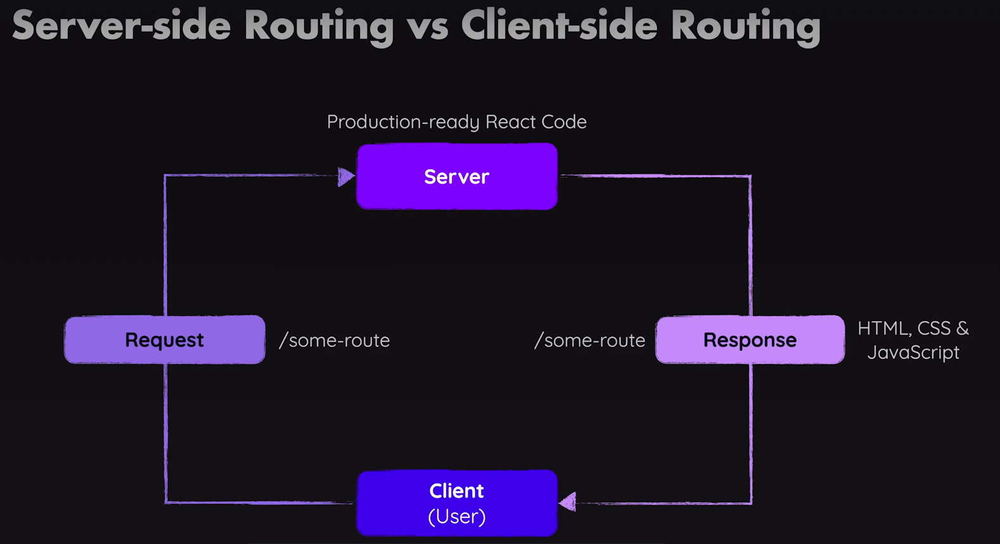

# Deployment

### Deployment Steps

- **Test Code**: Manually & with automated tests.
- **Optimize Code**: Optimize user experience & performance.
- **Build App**: Run build process to parse, transform & optimize code.
- **Upload App**: Upload production code to hosting server. such as
  - [Netlify](https://www.netlify.com/)
  - [Vercel](https://vercel.com/)
  - [Firebase](https://firebase.google.com/docs/hosting)
- **Configure Server**: Ensure app is served secuerly & as intended.

### Server-side Routing vs Client-side Routing

This project have the explaination of lazy loading, and implemented lazy loading.
Moreover, created the build folder and uploaded it to firebase.
The code is deployed [Here](https://react-deploy-demo-3a748.web.app)

Lazy Loading means that we wanna load certain pieces of code only when its need.

Q. What exactly is lazy loading and how does it work?
The idea behind lazy loading is that we load certain components in the end, only when they're needed instead of ahead of time.
